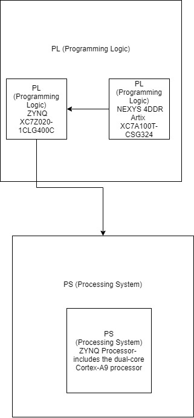
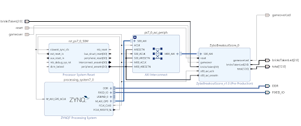
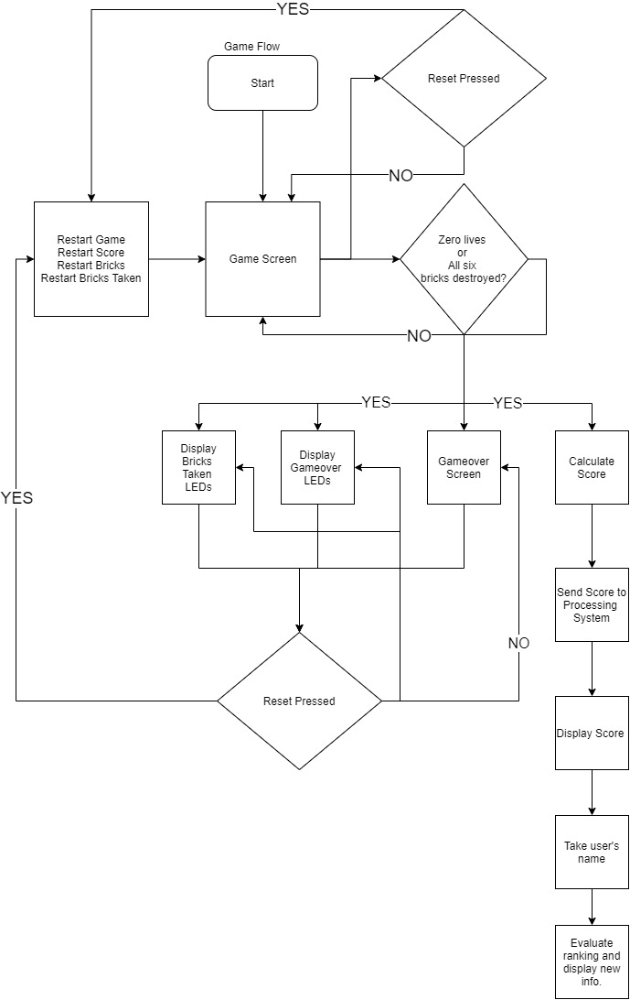
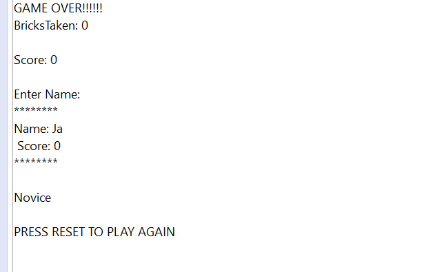
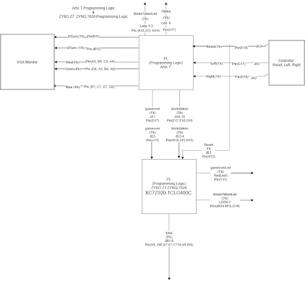

# BreakoutZyboVGAScore
Uses the zybo and nexys 4 ddr to play a game of breakout. The nexys4ddr and zynq-7020 are used to play and score a game of breakout.

# PS (processing system)  PL (Programming Logic) communication 
The programming logic of the Nexys 4 ddr outputs the game via vga and takes game input. While the Zybo's programming logic calcuates the score. Upon the game ending the Zybo's 
programming logic sends the results to the processing logic which is sent to via UART to the PC to output the data.

The Zybo's PS-PL communication was completed through the use of vivado's custom ip blocks. 

# Breakout Flow Chart
The player plays a game. Upon the game ending the PC asks the player to type a name into the monitor, which will be outputted with the player's score on the terminal. 

# Schematic

